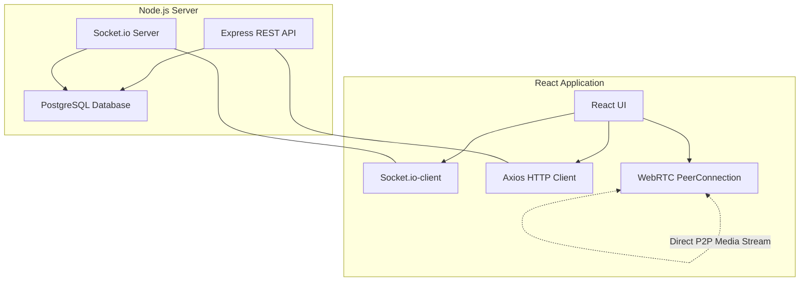

<div align="center">
  <h1>🌟 ConnectHub</h1>
  <p><strong>A Full-Stack Real-Time Communication Platform</strong></p>

  [](https://react.dev)
  [](https://nodejs.org)
  [](https://postgresql.org)
  [](https://webrtc.org)
  [](https://socket.io)
  
</div>

## 📖 Overview

ConnectHub is a comprehensive real-time chat and video calling application mimicking features of popular networking apps like WhatsApp Web. It handles secure user authentication, direct peer-to-peer media communication, and instantaneous message delivery.

## ✨ Features

- 🔐 **Secure Authentication**: Robust JWT-based auth with `bcryptjs` password hashing.
- 💬 **Real-time Chatting**: Instant messaging using Socket.io, complete with *typing indicators* and unread counts.
- 📹 **P2P Video & Audio Calling**: Leveraging **WebRTC** for direct browser-to-browser media streaming.
- 🖥️ **Screen Sharing**: Effortlessly share your screen seamlessly during active video calls.
- 👥 **Presence System**: See who is Online, Offline, or Idle in real-time.
- 🧑‍🤝‍🧑 **Friend Requests**: Send, accept, or reject peer connections.
- 🫸 **Privacy Controls**: Block unwanted users easily.
- 📋 **Call History**: Track call duration, missed calls, and history across users.

---

## 🏗️ Architecture Stack



| Layer | Technologies Used |
|---|---|
| **Frontend** | React 19, React Router v7, Axios, Socket.io-client |
| **Backend** | Node.js, Express.js |
| **Database** | PostgreSQL |
| **Real-time & Media** | WebRTC (P2P), Socket.io (Signaling) |

---

## 🚀 Getting Started

### 1. Prerequisites
- **Node.js** v18+
- **PostgreSQL** v14+

### 2. Database Initialization
```sql
CREATE DATABASE connecthub;
\c connecthub

-- Create tables
CREATE TABLE users (
    id SERIAL PRIMARY KEY,
    username VARCHAR(50) UNIQUE NOT NULL,
    email VARCHAR(100) UNIQUE NOT NULL,
    password_hash VARCHAR(255) NOT NULL,
    avatar_url VARCHAR(255),
    is_online BOOLEAN DEFAULT FALSE,
    last_seen TIMESTAMP,
    created_at TIMESTAMP DEFAULT CURRENT_TIMESTAMP
);

CREATE TABLE messages (
    id SERIAL PRIMARY KEY,
    sender_id INTEGER REFERENCES users(id) NOT NULL,
    receiver_id INTEGER REFERENCES users(id) NOT NULL,
    message TEXT NOT NULL,
    is_read BOOLEAN DEFAULT FALSE,
    created_at TIMESTAMP DEFAULT CURRENT_TIMESTAMP
);

CREATE TABLE calls (
    id SERIAL PRIMARY KEY,
    caller_id INTEGER REFERENCES users(id) NOT NULL,
    receiver_id INTEGER REFERENCES users(id) NOT NULL,
    call_type VARCHAR(10) NOT NULL,
    status VARCHAR(20) NOT NULL DEFAULT 'completed',
    duration INTEGER DEFAULT 0,
    started_at TIMESTAMP,
    ended_at TIMESTAMP,
    created_at TIMESTAMP DEFAULT CURRENT_TIMESTAMP
);
```

### 3. Backend Setup
```bash
cd backend
cp .env.example .env   # Provide DB credentials and JWT secret
npm install
npm run dev
```

### 4. Frontend Setup
```bash
cd frontend
npm install
npm run dev
```

The app will be running at [http://localhost:5173](http://localhost:5173) and the API on `http://localhost:5000`.

---

## 🧠 How WebRTC Works in ConnectHub

1. **Permission**: User A initiates a call; the browser requests camera/microphone permissions.
2. **Signaling**: A `call_request` socket event notifies User B.
3. **Acceptance**: User B accepts, dispatching a `call_accepted` event.
4. **Offer**: User A generates an SDP **Offer** and sends it to User B.
5. **Answer**: User B accepts the Offer, creates an **Answer**, and replies.
6. **ICE Candidates**: Both peers exchange ICE candidates to discover optimal network paths.
7. **Connection Established**: P2P data flow commences without server interference.

---
*Built for educational and portfolio purposes.*
